# 灵眸 LingMou — Wearable Smart Interactive Pendant Based on Multimodal Perception (Breadboard Prototype)

[简体中文](README.zh-CN.md) | [English](README.md)

<p align="center">
  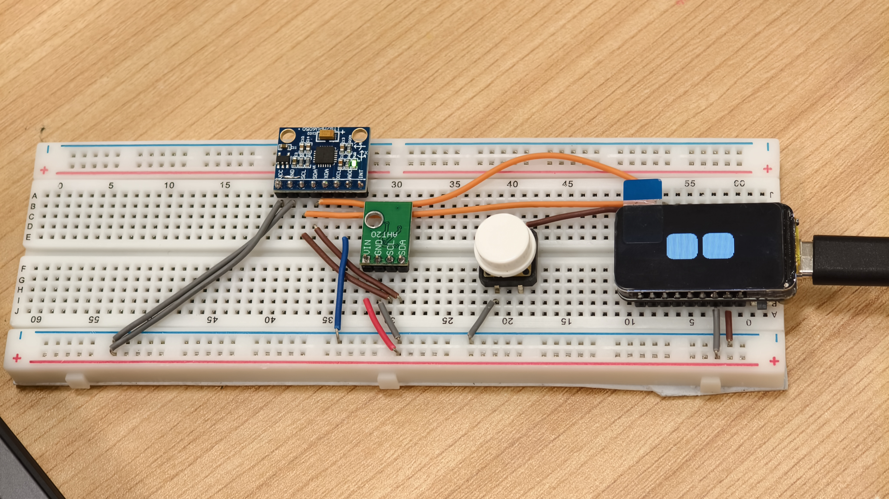
</p>

<p align="center">
  <b>A wearable smart interactive pendant that senses the world and responds with emotive eyes.</b><br>
  <i>灵眸 LingMou — 让机器拥有会回应世界的眼睛。</i>
</p>

<p align="center">
  <a href="LICENSE"></a>
  
  
  
  
  
  
</p>

---

## Overview

**LingMou (灵眸)** is a low-cost, lightweight **wearable smart interactive pendant based on multimodal perception** built around an **ESP32-C6** microcontroller and a **1.47" ST7789 LCD**. It fuses posture sensing (MPU6050), environmental sensing (AHT20), BLE + WiFi dual-channel communication, and a Uni-app mobile controller into a small wearable gadget that does not just *display* information — it **perceives, decides, expresses, and responds**.

> **Status — breadboard prototype.** The current release is a **breadboard test version** built for functional validation and rapid iteration; it is **not yet a production-grade PCB design**. A formal PCB layout and enclosure are planned for the production release.

Tilt it, shake it, or talk to it through the mobile app: its LCD eyes blink, gaze, get scared, and switch between **18 emotions** in real time, all driven by an on-board sensing-to-expression pipeline.

> **One-line definition:** A wearable smart pendant that implements a full *Perception → Decision → Expression → Feedback* loop using an animated eye display, on-board IMU / environmental sensors, and BLE / WiFi dual-channel communication.

This project originated as a university short-term training (小学期) team project and is released as open source for learning, hacking, and extending. The full design document lives at [`docs/LingMou_Project_Design.md`](docs/LingMou_Project_Design.md).

---

## Demo

<p align="center">
  
  &nbsp;
  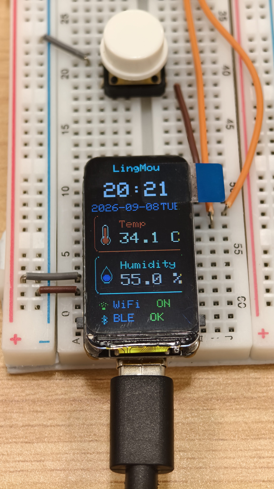
</p>
<p align="center"><i>Left: Eye Mode (animated emotive eyes). Right: Info Mode (time, temperature, humidity, WiFi/BLE status).</i></p>

---

## Key Features

- **18 emotive eye expressions** — Normal, Angry, Glee, Happy, Sad, Worried, Focused, Annoyed, Surprised, Skeptic, Frustrated, Unimpressed, Sleepy, Suspicious, Squint, Furious, Scared, Awe.
- **Gesture-driven gaze** — MPU6050 X / Y acceleration is mapped to eye look direction in `[-1, 1]`. Tilt the device, the eyes follow.
- **Physical disturbance → Scared** — A sudden shake detected via total acceleration magnitude automatically triggers the *Scared* emotion for ~1.5 s, then recovers to *Normal*.
- **Environment sensing** — On-board AHT20 reports temperature and humidity every ~3 s; shown on the device, over BLE, and via HTTP.
- **Two display modes on one screen** — *Eye Mode* (animated emotive eyes) and *Info Mode* (time, date, weekday, T / H, WiFi / BLE status) toggled by a physical button.
- **BLE + WiFi dual channel** — BLE is the always-on control and provisioning channel; WiFi adds a high-throughput HTTP telemetry channel. Either can fail without breaking the other.
- **BLE-assisted WiFi provisioning** — First-time WiFi credentials are entered in the mobile app and sent over BLE (with fragmentation for long SSIDs / passwords); the device persists them to NVS and auto-reconnects on every boot.
- **Local HTTP API** — `GET /api/status` and `GET /api/telemetry` return JSON state for LAN / IoT integration.
- **Cross-platform mobile app** — Uni-app / Vue app with BLE scanning, eye control, X / Y gaze sliders, 18-emotion picker, WiFi drawer, and dark / light theme.
- **Graceful degradation** — If the IMU fails, eyes / BLE / WiFi still work. If WiFi dies, BLE control continues. If BLE advertising drops, a watchdog re-starts it.

---

## Architecture

The system is organized as a five-layer architecture — **App → Communication → Control → Perception / Expression → Hardware** — with a complete data loop:

<p align="center">
  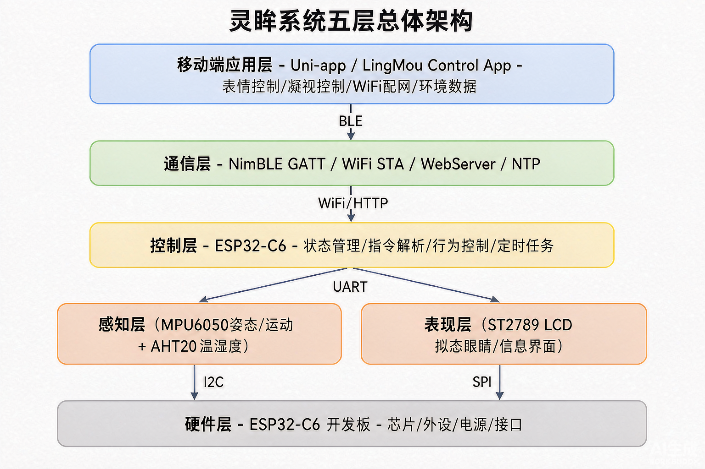
</p>

### Core Data Loop

```
Environment / posture change
        |
        v
   AHT20 / MPU6050
        |
        v
   ESP32-C6 acquisition
        |
        v
   State judgment & behavior logic
        |
        v
   Face / gaze engine
        |
        v
   LCD visual expression
        |
        v
   BLE / WiFi telemetry
        |
        v
   Mobile App display
        |
        v
   User control command  ────────────►  back to ESP32-C6
```

<p align="center">
  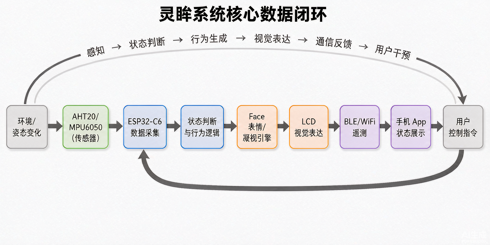
</p>

This is the full *Perception → Decision → Expression → Communication → User intervention* closed loop.

---

## Hardware

The current prototype is built on the **Waveshare ESP32-C6-LCD-1.47** development platform.

| Module        | Part                          | Role                                                    |
| :------------ | :---------------------------- | :------------------------------------------------------ |
| MCU           | ESP32-C6                      | Main controller, BLE GATT, WiFi STA, HTTP, NTP, FSM      |
| Display       | ST7789 LCD (172 × 320, SPI)   | Emotive eyes + Info UI                                  |
| IMU           | MPU6050 (I2C)                 | Tilt → gaze direction; shake → Scared                   |
| Environment   | AHT20 (I2C)                   | Temperature & humidity                                  |
| Button        | Tactile switch on GPIO 9      | Toggle Eye Mode ↔ Info Mode                             |
| Power         | USB / 5 V                     | System power                                            |

### Pinout (ESP32-C6 ↔ LCD / Sensors)

**LCD (SPI):**

| Function   | GPIO |
| :--------- | :--- |
| MOSI       | 6    |
| SCLK       | 7    |
| CS         | 14   |
| DC         | 15   |
| RST        | 21   |
| Backlight  | 22   |
| SD CS      | 4    |

**I2C bus (MPU6050 + AHT20):**

| Function | GPIO |
| :------- | :--- |
| SDA      | 18   |
| SCL      | 19   |

**Button:** GPIO 9 — internal pull-up, falling-edge interrupt, ~300 ms debounce.

### Hardware Gallery

<p align="center">
  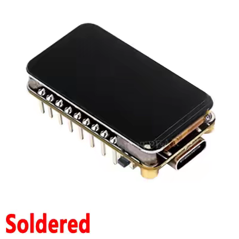
  &nbsp;
  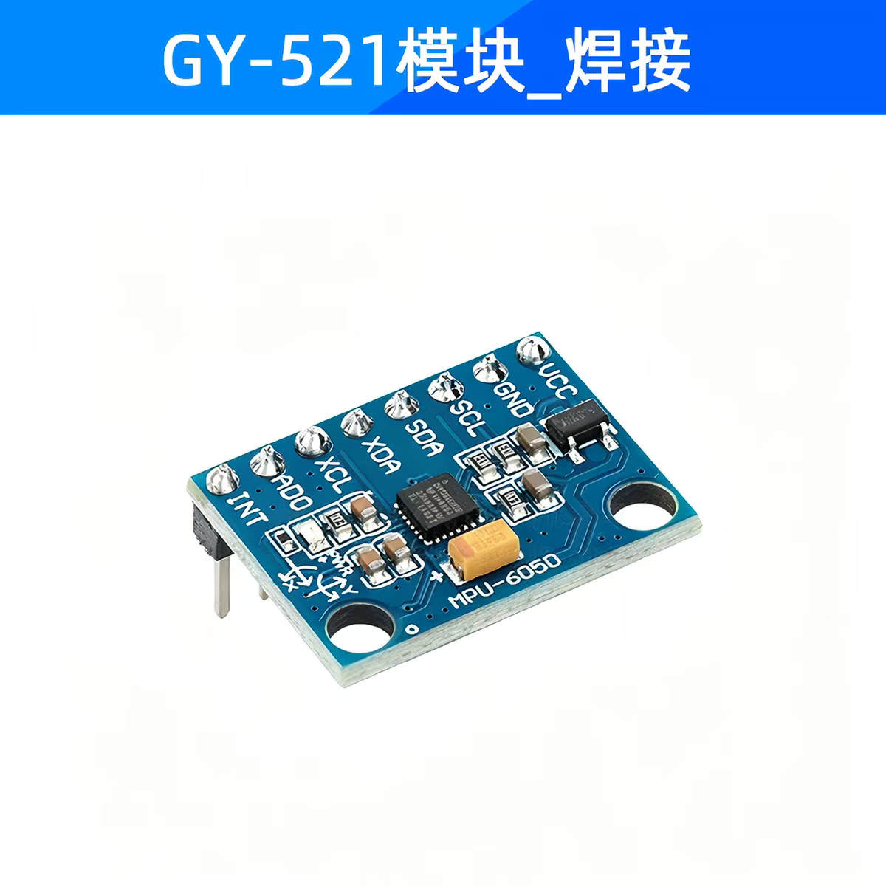
  &nbsp;
  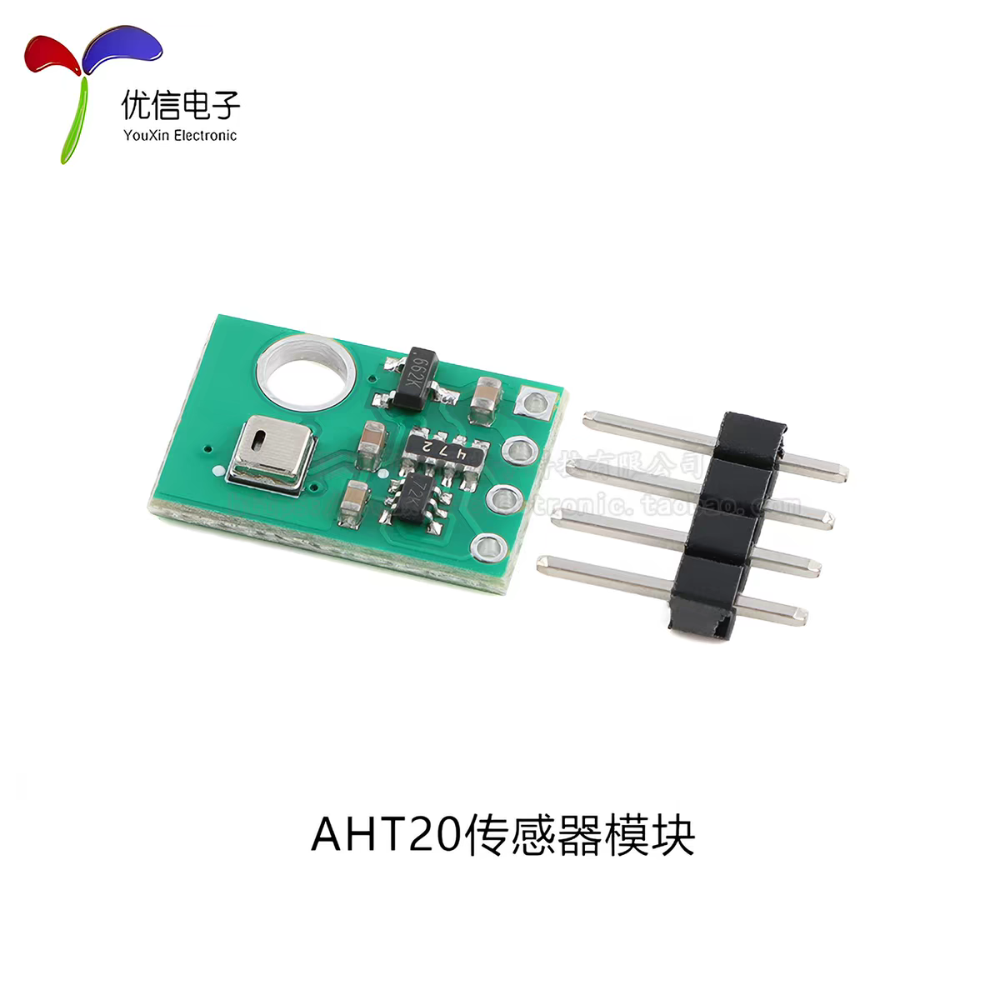
</p>

### Recommended BOM

| Module      | Part                       | Qty |
| :---------- | :------------------------- | :-- |
| MCU         | ESP32-C6 dev board         | 1   |
| Display     | ST7789 1.47" LCD (172×320) | 1   |
| IMU         | MPU6050 breakout           | 1   |
| Environment | AHT20 breakout             | 1   |
| Button      | 6 mm tactile switch        | 1   |
| Power       | USB-C / 5 V supply         | 1   |
| Enclosure   | 3D-printed / custom        | 1   |

### Two Display Modes

- **Eye Mode (default)** — The primary interaction surface. Displays the animated emotive eyes with auto-blink, posture-following gaze, app-driven gaze, random behavior, and random gaze.
- **Info Mode** — A low-frequency (~1 Hz) information panel showing current time, date, weekday, temperature, humidity, and WiFi / BLE status. Refresh rate is intentionally low to avoid unnecessary full-screen redraws.

  The mobile app mirrors this duality with its own **Eye Mode** and **Info Mode** pages (see the *Mobile App* section for screenshots).

Toggle between them on-device with the physical button on GPIO 9, or from the app's "View Mode" card.

---

## Firmware (ESP32-C6)

The firmware is an Arduino-framework sketch organized into logical layers:

```
LingMou Firmware
|
+-- Hardware Layer        LCD / MPU6050 / AHT20 / Button
+-- Face Engine           Blink, Emotion, LookAt, RandomBehavior, RandomLook
+-- Communication         BLE (NimBLE), WiFi, HTTP API, NTP
+-- Storage               Preferences / NVS (WiFi credentials)
+-- UI                    Eye Mode, Info Mode
+-- Main Scheduler        non-blocking loop()
```

### Boot Flow

<p align="center">
  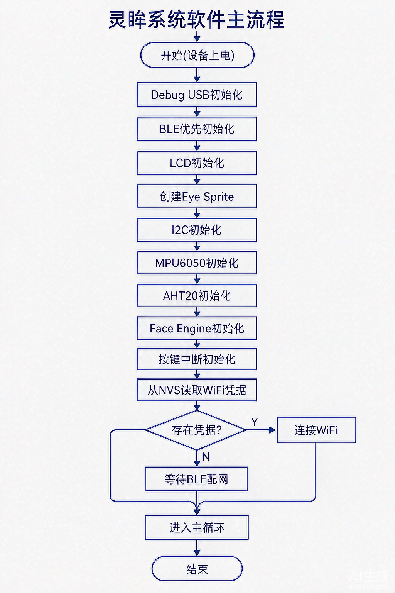
</p>

BLE is initialized early on purpose, so the device remains discoverable and provisionable even if some peripherals misbehave at boot.

### The Face Engine

- ~30 FPS animation loop (~33 ms / frame) using **TFT_eSPI Sprite** off-screen buffers rendered through **Arduino_GFX** to the ST7789 — this avoids full-screen flicker during complex eye animations.
- Automatic blinking, manual blink (`B:1`), gaze control (`X:x,y`), random gaze, random behavior, emotion switching (`E:n`), and posture-driven gaze.
- **MPU6050 → Gaze mapping:** `ax`, `ay` are normalized to `look_x`, `look_y ∈ [-1, 1]`. Tilt left / right → eyes look left / right; tilt forward / back → eyes look up / down. This is the *embodiment* link between physical and virtual.
- **Shake → Scared:** total acceleration `A = √(ax² + ay² + az²)`; when `|A − g|` exceeds a threshold, the engine enters *Scared* for ~1.5 s, then recovers to *Normal*.

### 18 Emotions

| #  | Emotion     | #  | Emotion      | #  | Emotion       |
| :- | :---------- | :- | :----------- | :- | :------------ |
| 0  | Normal      | 6  | Focused      | 12 | Sleepy        |
| 1  | Angry       | 7  | Annoyed      | 13 | Suspicious    |
| 2  | Glee        | 8  | Surprised    | 14 | Squint        |
| 3  | Happy       | 9  | Skeptic      | 15 | Furious       |
| 4  | Sad         | 10 | Frustrated   | 16 | Scared        |
| 5  | Worried     | 11 | Unimpressed  | 17 | Awe           |

### Task Schedule (non-blocking)

| Task                  | Period / trigger      |
| :-------------------- | :-------------------- |
| Eye animation         | ~33 ms (~30 FPS)      |
| AHT20 read            | ~3 s                  |
| Info UI refresh       | ~1 s                  |
| NTP update            | ~30 s                 |
| BLE advertising check | ~2 s (watchdog)       |
| WiFi retry            | ~30 s                 |
| Mode toggle button    | GPIO interrupt        |

---

## Communication

### BLE (NimBLE GATT)

- **Device name:** `LingMou`
- **Service UUID:** `4fafc201-1fb5-459e-8fcc-c5c9c331914b`
- **RX (App → Device):** `beb5483e-36e1-4688-b7f5-ea07361b26a8`
- **TX (Device → App, Notify):** `beb5483e-36e1-4688-b7f5-ea07361b26a9`

A lightweight text protocol is used for control; fragment size auto-adapts to peer MTU so JSON status messages and long SSIDs / passwords are not truncated.

| Command          | Example                              | Function                              |
| :--------------- | :----------------------------------- | :------------------------------------ |
| Blink            | `B:1`                                | Trigger a single blink                |
| Random behavior  | `I:1`                                | Enable random behavior                |
| Random gaze      | `W:1`                                | Enable random gaze                    |
| Emotion          | `E:3`                                | Switch to emotion #3 (Happy)          |
| Gaze             | `X:0.5,-0.3`                         | Set eye X / Y direction               |
| Get status       | `GET_STATUS`                         | Return device status                  |
| Get telemetry    | `GET_TELEMETRY`                      | Return environment data               |
| Phone time sync  | `TIME=<epoch>`                       | Sync system time from phone           |
| WiFi SSID        | `WIFI_SSID=xxx` (and `WIFI_SSID+`)   | Set WiFi name (supports fragments)    |
| WiFi password    | `WIFI_PASS=xxx` (and `WIFI_PASS+`)   | Set password (supports fragments)     |
| Connect WiFi     | `WIFI_CONNECT`                       | Save & connect                        |
| Clear network    | `WIFI_CLEAR`                         | Clear saved WiFi configuration        |

A **BLE advertising watchdog** re-starts advertising if it detects the stack has stopped broadcasting — improving app re-connect reliability.

### WiFi & HTTP API

After WiFi connects, the device starts a local webserver on port **80**:

```
GET /api/status
GET /api/telemetry
```

**`/api/telemetry` example response:**

```json
{
  "t": 25.6,
  "h": 48.3,
  "aht": 1,
  "time": "14:32:18",
  "wifi": 1
}
```

**`/api/status`** returns WiFi state, connection state, BLE state, SSID, IP address, and the latest telemetry payload.

- 1-shot connect timeout: ~15 s, retry delay: ~30 s, with auto-reconnect.
- WiFi credentials are stored in NVS; the device auto-joins the saved network on every boot.
- If WiFi is unreachable, **BLE remains fully operational** for control and telemetry fallback.

### Time Sync

The device supports two time sources, so the clock is always correct:

- **BLE phone time** (`TIME=<unix>`) when no WiFi is available.
- **NTP** (`pool.ntp.org`, displayed in UTC+8) when WiFi is connected.

---

## Mobile App (Uni-app / Vue)

The companion **LingMou Control** app is built with **Uni-app / Vue** and provides:

- BLE permission handling across Android versions (12+ nearby-devices vs. legacy location).
- BLE scanning with Service-UUID primary filter and name / historical-ID fallback.
- Device discovery, GATT connection, characteristic subscription, and command sending.
- A **Bento Grid + Glass Card** home with: link status, view-mode toggle, eye controls, 18-emotion picker, X / Y gaze sliders, and a live environment panel.
- A **WiFi provisioning drawer** with three-stage progress (BLE → configured → online) and resulting IP display.
- Light / dark theme.

#### Eye Mode

<p align="center">
  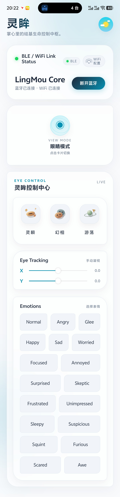
  &nbsp;
  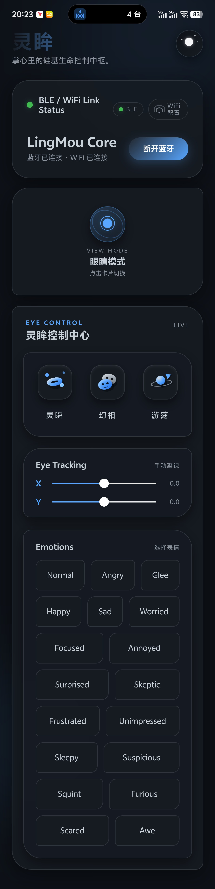
</p>
<p align="center"><i>Eye Mode: 18-emotion picker + eye control. Left: light theme, right: dark theme.</i></p>

#### Info Mode

<p align="center">
  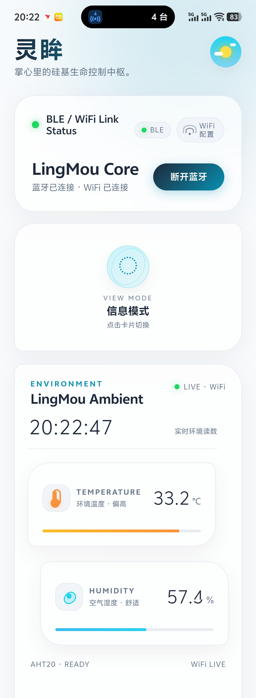
  &nbsp;
  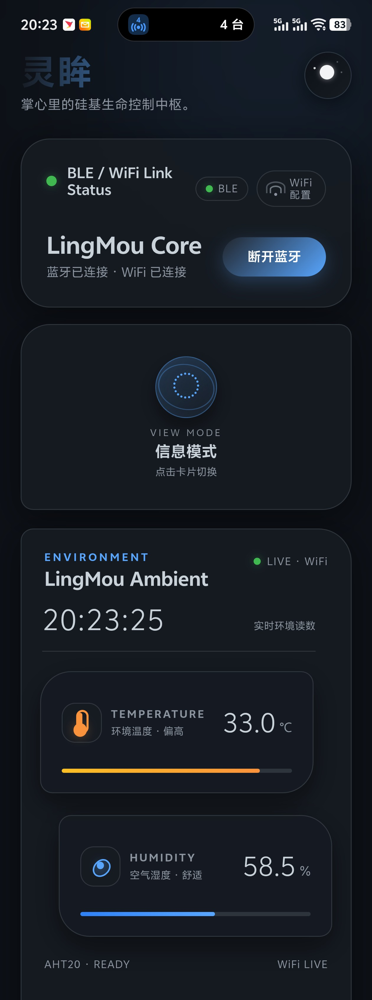
</p>
<p align="center"><i>Info Mode: real-time clock + temperature / humidity (with comfort band) + AHT20 / WiFi live status. Left: light theme, right: dark theme.</i></p>

#### WiFi Provisioning

<p align="center">
  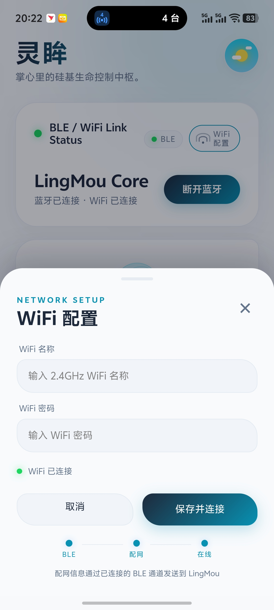
</p>
<p align="center"><i>WiFi provisioning drawer: BLE → configured → online, with resulting IP display.</i></p>

---

## Reliability

| Failure scenario              | Behavior                                                                |
| :---------------------------- | :---------------------------------------------------------------------- |
| MPU6050 init fails            | Eyes, BLE, WiFi, AHT20 keep working — only posture-driven gaze disabled |
| AHT20 init fails              | Eyes, posture, BLE, WiFi keep working — T / H shows "unavailable"       |
| WiFi down                     | HTTP telemetry unavailable; BLE control and telemetry keep working      |
| BLE advertising drops         | Watchdog re-starts advertising within ~2 s                              |
| Eye animation                 | Uses partial Sprite off-screen rendering to avoid full-screen flicker   |
| Info Mode                     | Refreshes at ~1 Hz to avoid unnecessary full-screen redraws             |

---

## Getting Started

### 1. Hardware

Wire the modules to the ESP32-C6 according to the pinout table above (or use the **Waveshare ESP32-C6-LCD-1.47** platform for a drop-in setup). Power via USB-C.

### 2. Firmware

The firmware lives at `Firmware/LingMou/LingMou.ino` and targets the Arduino framework on **ESP32-C6**.

**Arduino IDE / arduino-cli:**

1. Install the **ESP32** board package (≥ 3.x) via Board Manager.
2. Install the following libraries (Library Manager):
   - `Arduino_GFX_Library`
   - `TFT_eSPI`
   - `NimBLE-Arduino`
   - `Adafruit AHT20`
   - `Adafruit MPU6050` (+ `Adafruit Unified Sensor`, `Adafruit BusIO`)
3. Open `Firmware/LingMou/LingMou.ino`.
4. Select board: `ESP32C6 Dev Module` (or the Waveshare ESP32-C6-LCD-1.47 variant if installed).
5. Build and flash.

> All pin assignments are defined at the top of `LingMou.ino` — adjust them if you wire to a different ESP32-C6 board.

### 3. Mobile App

The app source lives in `App/` (Uni-app project, `pages/index/index.vue` entry).

1. Open the project in **HBuilderX** (the official Uni-app IDE), or in VS Code with the Uni-app Vue plugin.
2. Run to your phone (Android / iOS) or to the built-in browser.
3. Grant Bluetooth permissions (and on Android 12+, nearby-devices permission).
4. The app will scan for `LingMou` and connect automatically once found.

### 4. First Boot

1. Power on the device — eyes appear in *Eye Mode* (Normal).
2. Open the app, scan, and connect via BLE.
3. Open the **WiFi drawer**, enter your SSID and password, tap *Save & Connect*.
4. The device joins WiFi and reports its IP — you can now use the HTTP API too.
5. Try tilting the device (gaze follows) and giving it a small shake (*Scared*).
6. Press the physical button to switch to *Info Mode* (time / T / H / WiFi / BLE status).

---

## Repository Layout

```
LingMou_SmallTeamProject/
├── Firmware/                       ESP32-C6 Arduino sketch
│   └── LingMou/
│       ├── LingMou.ino
│       ├── LingMouEngine.cpp
│       └── LingMouEngine.h
├── App/                            Uni-app / Vue mobile controller
│   ├── App.vue
│   ├── index.html
│   ├── main.js
│   ├── manifest.json
│   ├── pages.json
│   ├── pages/index/index.vue
│   └── static/logo.png
├── docs/
│   ├── images/                     All README / doc images
│   └── LingMou_Project_Design.md   Full design document (Chinese)
├── .gitignore
├── LICENSE
├── README.md                       English README (default)
└── README.zh-CN.md                 Simplified Chinese README
```

The firmware keeps a compact structure — a main sketch (`LingMou.ino`) plus a dedicated `LingMouEngine` module — and is planned to be further refactored into `display/`, `sensors/`, `communication/`, `behavior/`, and `storage/` modules.

---

## Testing

The project ships with a 20-item functional test plan and target acceptance metrics:

| Metric                       | Target                              |
| :--------------------------- | :---------------------------------- |
| Eye animation                | ≥ 25 FPS                            |
| BLE control response         | < 300 ms                            |
| App → device emotion switch  | < 500 ms                            |
| BLE re-connect               | Auto advertising recovery           |
| T / H refresh                | ≤ 3 s                               |
| WiFi provisioning success    | ≥ 95% (normal network)              |
| Continuous run               | ≥ 24 h no lockup                    |
| WiFi outage                  | BLE control unaffected              |

A selection of the functional checks:

- **F01** power-on: LCD, BLE start normally
- **F04** blink control: app triggers blink on device
- **F05** emotion control: 18 emotions switch correctly
- **F09** posture detection: tilting the device changes gaze direction
- **F10** disturbance detection: a clear shake triggers *Scared*
- **F14** BLE provisioning: app can write WiFi to device
- **F15** WiFi auto-connect: device joins saved network on reboot
- **F16** HTTP API: `status` / `telemetry` readable
- **F18** WiFi outage: BLE control still works

---

## Roadmap

The current prototype is feature-complete for its scope. Planned evolution:

- **Phase 1 — Polish:** unified BLE command protocol, device state machine, app auto-reconnect, more telemetry, animation efficiency, parameter config page, 24 / 48 h stability tests.
- **Phase 2 — Sound:** MEMS mic + I2S amp + speaker, beeps, wake-word, local keyword spotting. Becomes a *vision + posture + environment + sound* interactive device.
- **Phase 3 — AI:** call a cloud / on-device LLM that returns structured actions like:

  ```json
  {
    "emotion": "Happy",
    "look_x": 0.3,
    "look_y": -0.2,
    "action": "blink"
  }
  ```

  for the device to execute — *"cloud intelligence + local real-time execution"*.
- **Phase 4 — Autonomous behavior:** an internal state machine (`Energy, Mood, Curiosity, Comfort, Attention, Sleepiness`) evolves with environment and user behavior, driving expressions and actions (e.g. long idle → *Sleepy*; picked up → *Awe / Happy*).
- **Engineering:** WiFi OTA, unified JSON protocol, formal state machine (`BOOT / IDLE / INTERACTIVE / INFO / SLEEP / ALERT / PAIRING / OTA / ERROR`), low-power mode, parameter persistence (brightness, default mode, sensitivities, device name).

---

## Contributing

Issues and pull requests are welcome — especially for:

- New emotions / better face rendering
- Additional sensors (light, sound, gesture)
- Home Assistant / MQTT integration via the HTTP API
- Porting the firmware to other ESP32 + LCD combos

Please run a quick smoke test (boot → BLE connect → tilt → shake) before submitting.

---

## License

This project is released under the **MIT License** — see [`LICENSE`](LICENSE) for details. You can swap this for any OSI-approved license that fits your needs; MIT and Apache-2.0 are the most common for open hardware-friendly projects.

---

## Acknowledgments

- **Waveshare** — for the ESP32-C6-LCD-1.47 development platform.
- **Arduino_GFX**, **TFT_eSPI**, **NimBLE-Arduino**, **Adafruit AHT20 / MPU6050** — for the excellent open-source libraries that made this prototype possible.
- **Uni-app / Vue** — for cross-platform mobile development.

---

<p align="center">
  <i>灵眸 LingMou — 让机器拥有会回应世界的眼睛。<br>
  Give machines eyes that respond to the world.</i>
</p>
